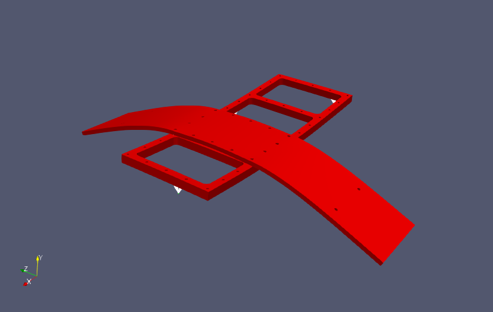

---
downloads:
  - file: sierrasd_eigen_read_from_escdf_python.ipynb
    title: Python Notebook (.ipynb)
  - file: sierrasd_eigen_read_from_escdf_python.py
    title: Python Script (.py)
  - file: sierrasd_eigen_read_from_escdf_matlab.ipynb
    title: Matlab Notebook (.ipynb)
  - file: sierrasd_eigen_read_from_escdf_matlab.m
    title: Matlab Script (.m)
  - file: sierrasd_eigen_read_from_escdf.md
    title: Markdown (.md)
---
# Reading Eigensolution Results from ESCDF to Exodus

This document will demonstrate how to take in eigensolution results (i.e. Modal Data) in the ESCDF format and translate it to an Exodus file for visualization in Paraview or other such tools using Matlab (with the 1553 Exodus Utilities) or Python (with SDynPy).

## Preliminary Setup
To start, we will perform preliminary operations needed by our respective programming languages.  In Matlab, we clear and reset the workspace.  In Python, we import our modules.  In both cases, we need to ensure the respective libraries needed are on the Matlab or Python path.

::::{tab-set}
:::{tab-item} Python
:sync: python
```{embed} #sierrasd_eigen_read_from_escdf:python:1
:remove-output: false
:remove-input: false
```
:::
:::{tab-item} Matlab
:sync: matlab
```{embed} #sierrasd_eigen_read_from_escdf:matlab:1
:remove-output: false
:remove-input: false
```
:::
::::

## Loading in ESCDF Results

The next step will be to load in the ESCDF files that we will be reading.  We will assume we have either created these files following the previous documentation page, or we have downloaded them from the above links.  To demonstrate the interoperability with ESCDF, we will open the version created using Matlab with Python and vice versa.

::::{tab-set}
:::{tab-item} Python
:sync: python
```{embed} #sierrasd_eigen_read_from_escdf:python:2
:remove-output: false
:remove-input: false
```
:::
:::{tab-item} Matlab
:sync: matlab
```{embed} #sierrasd_eigen_read_from_escdf:matlab:2
:remove-output: false
:remove-input: false
```
:::
::::

If we type in `esfile` into the command window or console, we will see the familiar structure of our ESCDF file.

::::{tab-set}
:::{tab-item} Python
:sync: python
```{embed} #sierrasd_eigen_read_from_escdf:python:3
:remove-output: false
:remove-input: false
```
:::
:::{tab-item} Matlab
:sync: matlab
```{embed} #sierrasd_eigen_read_from_escdf:matlab:3
:remove-output: false
:remove-input: false
```
:::
::::

## Identifying the Relevant Data and Metadata

In general, ESCDF files may contain many activities, each which link to many sets of data and many pieces of metadata.  They may also have different reference names assigned to them.  Therefore, when writing general functions to read in arbitrary ESCDF files, one should always reference the relevant activity or data, and use the links in ESCDF to pull the correct metadata associated with that activity, using the type of data or metadata to perform selection, rather than the name which might change from file to file.

In this case, the activity we want is the first (and only) activity in the file.  A general function may take as its input argument the activity name or activity index.  Here we simply select the first index.

::::{tab-set}
:::{tab-item} Python
:sync: python
```{embed} #sierrasd_eigen_read_from_escdf:python:4
:remove-output: false
:remove-input: false
```
:::
:::{tab-item} Matlab
:sync: matlab
```{embed} #sierrasd_eigen_read_from_escdf:matlab:4
:remove-output: false
:remove-input: false
```
:::
::::

Querying the `esact` variable in the command window or console will show us information on the activity.

::::{tab-set}
:::{tab-item} Python
:sync: python
```{embed} #sierrasd_eigen_read_from_escdf:python:5
:remove-output: false
:remove-input: false
```
:::
:::{tab-item} Matlab
:sync: matlab
```{embed} #sierrasd_eigen_read_from_escdf:matlab:5
:remove-output: false
:remove-input: false
```
:::
::::

We will then use the links in the activity to select from the metadata objects associated with the activity.  We will select the metadata based on its type being `geometry`.

::::{tab-set}
:::{tab-item} Python
:sync: python
```{embed} #sierrasd_eigen_read_from_escdf:python:6
:remove-output: false
:remove-input: false
```
:::
:::{tab-item} Matlab
:sync: matlab
```{embed} #sierrasd_eigen_read_from_escdf:matlab:6
:remove-output: false
:remove-input: false
```
:::
::::

We will do a similar process to select data in the activity that has the type `mode`.

::::{tab-set}
:::{tab-item} Python
:sync: python
```{embed} #sierrasd_eigen_read_from_escdf:python:7
:remove-output: false
:remove-input: false
```
:::
:::{tab-item} Matlab
:sync: matlab
```{embed} #sierrasd_eigen_read_from_escdf:matlab:7
:remove-output: false
:remove-input: false
```
:::
::::

## Extracting Geometry Information
We can remind ourselves of the properties in the geometry object by querying `esgeo` in the command window or console.  One thing to note is that all properties state `on disk`, meaning that ESCDF has not loaded them into memory.  Requesting data from these fields will read the data directly from disk.

::::{tab-set}
:::{tab-item} Python
:sync: python
```{embed} #sierrasd_eigen_read_from_escdf:python:8
:remove-output: false
:remove-input: false
```
:::
:::{tab-item} Matlab
:sync: matlab
```{embed} #sierrasd_eigen_read_from_escdf:matlab:8
:remove-output: false
:remove-input: false
```
:::
::::

To assemble an Exodus file, we need to extract the data in the `esgeo` object to produce a node number map, a node coordinate array, and the element blocks.  We should also pull out the local coordinate system information.  While this file is built entirely in global coordinates, arbitrary modal data that one might receive in ESCDF format may have local coordinate information, so any general scripts we might write should automatically look for that information.

One thing to also note is that we have not stored any information that would allow us to reconstruct which elements originally belonged to which element block.  The way we stored this information was more for results visualization than for reconstructing the analysis.  Therefore, we will simply reconstruct one element block per element type in the Exodus file.

::::{tab-set}
:::{tab-item} Python
:sync: python
```{embed} #sierrasd_eigen_read_from_escdf:python:9
:remove-output: false
:remove-input: false
```
:::
:::{tab-item} Matlab
:sync: matlab
```{embed} #sierrasd_eigen_read_from_escdf:matlab:9
:remove-output: false
:remove-input: false
```
:::
::::

To construct element blocks, we will loop through the different element types and select rows of the connectivity matrix corresponding to that type of element.  These we can then assemble into a regular array (instead of the original ragged array).  Note that the connectivity is stored in ESCDF with reference to the node number, not the node index like Exodus.  Therefore, we must create an inverse node map that maps the node number back to the index.  Similarly, Exodus element block names are not identical to ESCDF, so we should create an element type map as well.

::::{tab-set}
:::{tab-item} Python
:sync: python
```{embed} #sierrasd_eigen_read_from_escdf:python:10
:remove-output: false
:remove-input: false
```
:::
:::{tab-item} Matlab
:sync: matlab
```{embed} #sierrasd_eigen_read_from_escdf:matlab:10
:remove-output: false
:remove-input: false
```
:::
::::

## Extracting Modal Information
We must similarly extract modal information.  We can query the `esmode` object by typing it into the command window or console to remind ourselves of its properties.

::::{tab-set}
:::{tab-item} Python
:sync: python
```{embed} #sierrasd_eigen_read_from_escdf:python:11
:remove-output: false
:remove-input: false
```
:::
:::{tab-item} Matlab
:sync: matlab
```{embed} #sierrasd_eigen_read_from_escdf:matlab:11
:remove-output: false
:remove-input: false
```
:::
::::

We will extract the frequencies, the shape matrix, and the degree of freedom names from the dataset.

::::{tab-set}
:::{tab-item} Python
:sync: python
```{embed} #sierrasd_eigen_read_from_escdf:python:12
:remove-output: false
:remove-input: false
```
:::
:::{tab-item} Matlab
:sync: matlab
```{embed} #sierrasd_eigen_read_from_escdf:matlab:12
:remove-output: false
:remove-input: false
```
:::
::::

In Exodus, natural frequency information is stored as the time step.  Mode shape information is by default stored in variable names `DispX`, `DispY`, and `DispZ` for displacements and `RotX`, `RotY`, and `RotZ` for rotations.  We must create an array of values for each of these variables.  These will be nodal variables in the Exodus file, so there should be one value for each node for each time step.  We will assemble these as 3D arrays with shape `(num_nodes, 3, num_freqs)`.

::::{tab-set}
:::{tab-item} Python
:sync: python
```{embed} #sierrasd_eigen_read_from_escdf:python:13
:remove-output: false
:remove-input: false
```
:::
:::{tab-item} Matlab
:sync: matlab
```{embed} #sierrasd_eigen_read_from_escdf:matlab:13
:remove-output: false
:remove-input: false
```
:::
::::

ESCDF packages the degree of freedom names along with the shape matrix.  Therefore, we should never assume that the shape matrix is ordered in any specific way.  We must parse the degree of freedom names and reference it back to the node number map in order to identify the correct row of the nodal variable array we are creating.  Similarly, we should not assume that we are working in global coordinate systems and simply assign `X` degree of freedom values to the first column.  We must multiply `X` degrees of freedom by the `node_x_direction vector` to reconstruct the global motion.

We can use regular expressions to parse out the node number, direction, and polarity of the degree of freedom name.  The node number is passed to the node map to produce the node index, and these are used along with the direction string to select the direction vector.  The shape coefficient is then multiplied by the direction vector, and it is added to the proper displacement or rotation shape matrix.  By adding the values, we allow the contributions from the X, Y, and Z displacements to be summed together rather than the Z overwriting the X, for example.

::::{tab-set}
:::{tab-item} Python
:sync: python
```{embed} #sierrasd_eigen_read_from_escdf:python:14
:remove-output: false
:remove-input: false
```
:::
:::{tab-item} Matlab
:sync: matlab
```{embed} #sierrasd_eigen_read_from_escdf:matlab:14
:remove-output: false
:remove-input: false
```
:::
::::

## Building the Exodus File
Now that we have constructed all of the data that the Exodus file might need, we can put it into the Exodus format.  This will look significantly different between Matlab and Python due to the differences in the 1553 Exodus Utilities and SDynPy Exodus implementation.  The 1553 Exodus Utilities construct the Exodus file in memory then write it to disk at the end.  The SDynPy Exodus tools create a file on disk immediately, then the various values are stored to that file via its function calls.

We can query the exodus object exo to see properties of the exodus file we've created.

::::{tab-set}
:::{tab-item} Python
:sync: python
```{embed} #sierrasd_eigen_read_from_escdf:python:15
:remove-output: false
:remove-input: false
```
:::
:::{tab-item} Matlab
:sync: matlab
```{embed} #sierrasd_eigen_read_from_escdf:matlab:15
:remove-output: false
:remove-input: false
```
:::
::::

We can load these models into a tool such as [Paraview](https://www.paraview.org/) to verify that the Exodus files were created successfully.


