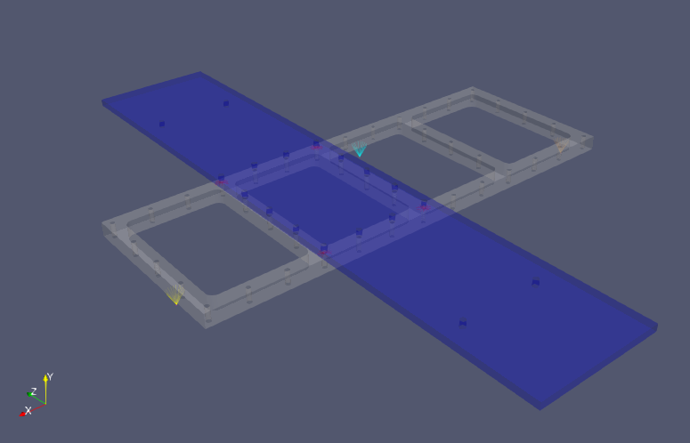

---
downloads:
  - file: sierrasd_eigen_write_to_escdf_python.ipynb
    title: Python Notebook (.ipynb)
  - file: sierrasd_eigen_write_to_escdf_python.py
    title: Python Script (.py)
  - file: sierrasd_eigen_write_to_escdf_matlab.ipynb
    title: Matlab Notebook (.ipynb)
  - file: sierrasd_eigen_write_to_escdf_matlab.m
    title: Matlab Script (.m)
  - file: sierrasd_eigen_write_to_escdf.md
    title: Markdown (.md)
---
# Writing Sierra/SD Eigensolution Results to ESCDF

This document will demonstrate how we can read in Exodus data using Matlab (with the 1553 Exodus Utilities) or Python (with [SDynPy](https://github.com/sandialabs/sdynpy)).  Eigensolutions form the basis for many of Sierra/SD's solution types, including ModalFRF, ModalTransient, and ModalRanVib.

The Exodus file used in this example is shown in the image below.



::::{tab-set}
:::{tab-item} Python
:sync: python
```{embed} #sierrasd_eigen_write_to_escdf:python:1
:remove-output: false
:remove-input: false
```
:::
:::{tab-item} Matlab
:sync: matlab
```{embed} #sierrasd_eigen_write_to_escdf:matlab:1
:remove-output: false
:remove-input: false
```
:::
::::

## Loading in Exodus Results

The next step will be to load in our Exodus file results.  We will assume we have saved the Exodus file linked above to the same directory as the scripts being run.  If that is not the case, the paths will need to be adjusted in the code snippets below accordingly.

::::{tab-set}
:::{tab-item} Python
:sync: python
```{embed} #sierrasd_eigen_write_to_escdf:python:2
:remove-output: false
:remove-input: false
```
:::
:::{tab-item} Matlab
:sync: matlab
```{embed} #sierrasd_eigen_write_to_escdf:matlab:2
:remove-output: false
:remove-input: false
```
:::
::::

The output can be verified by typing the variable name exo into the command window or console.

::::{tab-set}
:::{tab-item} Python
:sync: python
```{embed} #sierrasd_eigen_write_to_escdf:python:3
:remove-output: false
:remove-input: false
```
:::
:::{tab-item} Matlab
:sync: matlab
```{embed} #sierrasd_eigen_write_to_escdf:matlab:3
:remove-output: false
:remove-input: false
```
:::
::::

## Creating ESCDF Datasets

Whenever we are in the mode of creating archival forms of data, we must give careful consideration to what we store and what we don't.  Storing literally everything can bloat file sizes and lead to duplication of data.  Storing too little can result in missing data or metadata that may be important down the road.

The present Exodus file contains an eigensolution result.  This means it contains modes of the structure.  The mesh contained in the exodus file also contains the geometry information.  It might also be warranted to save some higher-level information about the analysis (points of contact, hardware fidelity, etc.).  Finally, for repeatability's sake, it may be useful to store items such as the input file to the analysis or information on where and how the model was run.  Including the initial mesh file could also be performed, but this data may largely be a duplicate of the geometry information stored in the file.  Different programs and users may wish to store varying fidelity of data based on their specific needs.  Before any significant project, data producers and consumers should come to an agreement as to which data and metadata needs to be stored.

To start, we will create an empty ESCDF file, which we will then populate with data and metadata from the Exodus file.

::::{tab-set}
:::{tab-item} Python
:sync: python
```{embed} #sierrasd_eigen_write_to_escdf:python:4
:remove-output: false
:remove-input: false
```
:::
:::{tab-item} Matlab
:sync: matlab
```{embed} #sierrasd_eigen_write_to_escdf:matlab:4
:remove-output: false
:remove-input: false
```
:::
::::

If we type the variable name `esfile` into the command window or console, we will see a representation of this empty ESCDF file.  Currently no activities or metadata are present in the file.

::::{tab-set}
:::{tab-item} Python
:sync: python
```{embed} #sierrasd_eigen_write_to_escdf:python:5
:remove-output: false
:remove-input: false
```
:::
:::{tab-item} Matlab
:sync: matlab
```{embed} #sierrasd_eigen_write_to_escdf:matlab:5
:remove-output: false
:remove-input: false
```
:::
::::

## Extracting Geometry Metadata

In order for a measurement or analysis result to be meaningful, it needs to have context behind it.  A simple time trace doesn't say much about a result if we don't know where that time trace was recorded on the structure and in which direction.  This geometry information is incredibly important for documenting test and analysis results.

In the context of an Exodus file, the geometry information comes from the mesh.  The node locations allow us to specify where a result is obtained.  Typically, Exodus data is represented in the global coordinate system, so we will not need to spend a significant amount of time worrying about local coordinate transformations in this case.  Let's create an empty `geometry` metadata object in ESCDF and then populate it with the required information from our model.  When we create a dataset, we must specify a name of the dataset, which is used to reference the dataset, as well as a type of the dataset.  This type defines the different properties that exist in the dataset.  In this case, our dataset will have the name `mesh_geometry` and the type `geometry`.  We can optionally give it a more descriptive name as well.

::::{tab-set}
:::{tab-item} Python
:sync: python
```{embed} #sierrasd_eigen_write_to_escdf:python:6
:remove-output: false
:remove-input: false
```
:::
:::{tab-item} Matlab
:sync: matlab
```{embed} #sierrasd_eigen_write_to_escdf:matlab:6
:remove-output: false
:remove-input: false
```
:::
::::

If we type in the name `esgeo` into the command window or console, we will get a representation of this dataset that shows the properties we can fill out.

::::{tab-set}
:::{tab-item} Python
:sync: python
```{embed} #sierrasd_eigen_write_to_escdf:python:7
:remove-output: false
:remove-input: false
```
:::
:::{tab-item} Matlab
:sync: matlab
```{embed} #sierrasd_eigen_write_to_escdf:matlab:7
:remove-output: false
:remove-input: false
```
:::
::::

At this point, we will need to fill out the information provided.  It may help to reference the `geometry.txt` specification file during this process to understand the different properties and their types.

```{code}
geometry
--------
extends: parameter_set

This group defines a test or analysis geometry, which includes
node positions and local directions associated with each node.

properties
----------
node_id - u8 - num_nodes
node_position - f8 - num_nodes,3
node_x_direction - f8 - num_nodes,3
node_y_direction - f8 - num_nodes,3
node_z_direction - f8 - num_nodes,3
line_connection - u8 - num_lines - variable_length,optional
line_color - u8 - num_lines,3 - optional
element_connection - u8 - num_elements - variable_length,optional
element_color - u8 - num_elements,3 - optional
element_type - str - num_elements - optional, enum:element_types
position_units - str

enumerations
------------
element_types - sphere1, bar2, bar3, tri3, tri6, quad4, quad8, tet4, tet10, hex8, hex20, wedge6, wedge15

notes
-----
Elements in the geometry are just for visualization, and therefore have no "physics" associated with them.
For example, there is no plane strain vs plane stress quad4, they are both represented by quad4.
```

We will start with the node identification numbers which will be stored in the `node_id` property.  We can extract this value from the Exodus result by accessing the node number map.  This will give us a 1D array of node numbers (technically in Matlab, this is a Nx1 array since Matlab cannot handle arrays with dimensionality less than 2).  We can then simply assign this value to the `node_id`  property of the `esgeo` object.  We can similarly extract the coordinates of the nodes from the exodus file and assign it to the `node_position` property.

::::{tab-set}
:::{tab-item} Python
:sync: python
```{embed} #sierrasd_eigen_write_to_escdf:python:8
:remove-output: false
:remove-input: false
```
:::
:::{tab-item} Matlab
:sync: matlab
```{embed} #sierrasd_eigen_write_to_escdf:matlab:8
:remove-output: false
:remove-input: false
```
:::
::::

If we look at the updated `esgeo` object, we can see that these fields have been populate automatically with the correct sizes and types of data.  We did not have to explicitly create an escdf Property object.  ESCDF was able to read in our raw array and build the property object for us.

::::{tab-set}
:::{tab-item} Python
:sync: python
```{embed} #sierrasd_eigen_write_to_escdf:python:9
:remove-output: false
:remove-input: false
```
:::
:::{tab-item} Matlab
:sync: matlab
```{embed} #sierrasd_eigen_write_to_escdf:matlab:9
:remove-output: false
:remove-input: false
```
:::
::::

Next, we will populate element information.  ESCDF allows elements and lines to be added to geometry to aid in visualizing results.  ESCDF uses an enumeration to specify valid types of elements.  These, however, may not be identical to the names found in the Exodus or any other finite element format, so some kind of mapping may be required.  Let's first investigate what type of elements exist and what their mapping should be.

::::{tab-set}
:::{tab-item} Python
:sync: python
```{embed} #sierrasd_eigen_write_to_escdf:python:10
:remove-output: false
:remove-input: false
```
:::
:::{tab-item} Matlab
:sync: matlab
```{embed} #sierrasd_eigen_write_to_escdf:matlab:10
:remove-output: false
:remove-input: false
```
:::
::::

We can see that our model has names like `HEX20`, `BEAM`, and `SPHERE`, whereas the geometry dataset wants element names like `hex20`, `bar2`, and `sphere1`.  The easiest way to handle this mapping is through a `Map` object in Matlab or a `dict` in Python.

::::{tab-set}
:::{tab-item} Python
:sync: python
```{embed} #sierrasd_eigen_write_to_escdf:python:11
:remove-output: false
:remove-input: false
```
:::
:::{tab-item} Matlab
:sync: matlab
```{embed} #sierrasd_eigen_write_to_escdf:matlab:11
:remove-output: false
:remove-input: false
```
:::
::::

Now we can go though and populate the element blocks and connectivity arrays.  We note that the `element_connection` property in the `geometry` object has a `variable_length` option.  This means that each row in the array may have variable number of columns.  This is appropriate for a element connectivity array because a `hex20` element will have 20 nodes while a `bar2` element will only have two.  For these properties, we can generally set up a cell array in Matlab or a list or NumPy object array in Python.  We loop through all elements in all blocks extracting the node numbers that are connected by that element.  We build these into our cell array.  We also use our `elem_map` to map each element type to the appropriate ESCDF name.  Of course, at the end, we must assign these values to the appropriate properties in the ESCDF `geometry` dataset.

One important consideration here is that Matlab cannot handle a 1D cell array to represent the connectivity array or the element type array.  By default, when we assign values to a cell using `{end+1}`, it will automatically append to the columns of the array, making a 1xN cell array.  However, for 1D arrays, ESCDF requires that they be formatted as Nx1 arrays, so we must transpose the values before assigning them to the ESCDF object.

::::{tab-set}
:::{tab-item} Python
:sync: python
```{embed} #sierrasd_eigen_write_to_escdf:python:12
:remove-output: false
:remove-input: false
```
:::
:::{tab-item} Matlab
:sync: matlab
```{embed} #sierrasd_eigen_write_to_escdf:matlab:12
:remove-output: false
:remove-input: false
```
:::
::::

Now if we query our `esgeo` object in the command window or console, we will see these latest two properties defined.  Note that we have not defined the `element_color`, which is an optional property.  If there was some meaningful color to assign each of the elements, or it significantly aided visualization, it may be useful to assign a color to each element.  However in this case, we will leave this property empty.

::::{tab-set}
:::{tab-item} Python
:sync: python
```{embed} #sierrasd_eigen_write_to_escdf:python:13
:remove-output: false
:remove-input: false
```
:::
:::{tab-item} Matlab
:sync: matlab
```{embed} #sierrasd_eigen_write_to_escdf:matlab:13
:remove-output: false
:remove-input: false
```
:::
::::

Because many properties can be optional, it may not be clear when a dataset is "complete".  ESCDF provides the `validate` method which will provide feedback as to whether a dataset is currently valid or not.  This method also gets called before writing data to disk, and will not allow incomplete datasets to be written.

If we call this method currently, it will show us that the dataset is indeed not complete.  Local coordinate system information must be specified in the form of `node_x_direction`, `node_y_direction`, and `node_z_direction` properties.  It will also tell us that we are missing the units on our position values.

::::{tab-set}
:::{tab-item} Python
:sync: python
```{embed} #sierrasd_eigen_write_to_escdf:python:14
:remove-output: false
:remove-input: false
```
:::
:::{tab-item} Matlab
:sync: matlab
```{embed} #sierrasd_eigen_write_to_escdf:matlab:14
:remove-output: false
:remove-input: false
```
:::
::::

The `node_<xyz>_direction` properties are meant to store local coordinate system directions in a test or analysis geometry.  Each should contain a unit vector represented in the global coordinate system that shows the direction of the respective local coordinate system direction.  In our case, the entire model is in the global coordinate system, so all `node_x_directions` should be `[1,0,0]`, all `node_y_directions` should be `[0,1,0]`, and all `node_z_directions` should be `[0,0,1]`.  The units on the position values stored are meters, so we will store `'m'`.

::::{tab-set}
:::{tab-item} Python
:sync: python
```{embed} #sierrasd_eigen_write_to_escdf:python:15
:remove-output: false
:remove-input: false
```
:::
:::{tab-item} Matlab
:sync: matlab
```{embed} #sierrasd_eigen_write_to_escdf:matlab:15
:remove-output: false
:remove-input: false
```
:::
::::

Now if we query our `esgeo` object, we will see that these properties are complete, and if we call the `validate` method, the method will return `True`.

::::{tab-set}
:::{tab-item} Python
:sync: python
```{embed} #sierrasd_eigen_write_to_escdf:python:16
:remove-output: false
:remove-input: false
```
:::
:::{tab-item} Matlab
:sync: matlab
```{embed} #sierrasd_eigen_write_to_escdf:matlab:16
:remove-output: false
:remove-input: false
```
:::
::::

::::{tab-set}
:::{tab-item} Python
:sync: python
```{embed} #sierrasd_eigen_write_to_escdf:python:17
:remove-output: false
:remove-input: false
```
:::
:::{tab-item} Matlab
:sync: matlab
```{embed} #sierrasd_eigen_write_to_escdf:matlab:17
:remove-output: false
:remove-input: false
```
:::
::::

## Extracting Modal Information

The next piece of information we wish to extract is the modal information from the eigensolution results.  Sierra/SD stores eigensolution results as a nodal variable with default names `DispX`, `DispY`, and `DispZ`. Rotational degrees of freedom are also stored in variables `RotX`, `RotY`, and `RotZ`. It stores natural frequency information in the timestep vector.  There is no damping in this model.

We will start by creating an empty `mode` dataset.  The specification file for a `mode` is shown below.

```{code}
mode
----
extends: activity_result

This defines a general format for storing modal data.

properties
----------
frequency - f8 - num_modes
damping_ratio - f8 - num_modes - optional
modal_mass - f8 - num_modes - optional
shape - f8 - num_dofs,num_modes - or:mode_type:real_modes
shape - c16 - num_dofs,num_modes - or:mode_type:complex_modes
dof_name - str - num_dofs - regex:^\d+(R?[XYZ]{1,2}[+-])?$
description - str - num_lines - optional

notes
-----
Real or complex modes can be stored using this format.
The dof_name field must be of the form <node_number><direction><polarity>.
node_number is any non-negative integer.
direction is an optional R (to signify rotation) followed by one or two of X, Y, or Z.
polarity is one of + or -.
If the channel does not have a direction or a polarity (e.g. a thermocouple), then
these can be left blank.
Examples of valid channel names include '6', '101X+', '204Z-', '412RY-', '100XX+', '32ZX-'.
```

We will call our `mode` dataset `eigen` and give it a descriptive name.

::::{tab-set}
:::{tab-item} Python
:sync: python
```{embed} #sierrasd_eigen_write_to_escdf:python:18
:remove-output: false
:remove-input: false
```
:::
:::{tab-item} Matlab
:sync: matlab
```{embed} #sierrasd_eigen_write_to_escdf:matlab:18
:remove-output: false
:remove-input: false
```
:::
::::

Interrogating the object by typing `esmode` into the command window or console shows us the structure of the empty dataset.

::::{tab-set}
:::{tab-item} Python
:sync: python
```{embed} #sierrasd_eigen_write_to_escdf:python:19
:remove-output: false
:remove-input: false
```
:::
:::{tab-item} Matlab
:sync: matlab
```{embed} #sierrasd_eigen_write_to_escdf:matlab:19
:remove-output: false
:remove-input: false
```
:::
::::

Now we can collect the data from the Exodus file and store it in the `mode` dataset.  The frequency and mode shape matrices are straightforward to pull out.  However ESCDF also requires us to define the `dof_name` associated with each row in the shape matrix.  This allows users of our data to understand the mapping between rows of the shape matrix and nodes and directions in the channel table.  In the above specification file, we note that the `dof_name` field has a `regex` option associated with it, meaning that the strings in it will be validated against that regular expression.  The notes provide additional information for those who do not understand regular expressions.  Essentially, this field must be a positive integer, then a direction specifier, then a polarity specifier.  The direction and polarity specifiers are optional; however in our case they should be provided because there are directions and polarities associated with our data.  In an Exodus file, the nodal data is stored in the same order as the node identification numbers, meaning we can simply append for each variable the direction specifier to the list of node identification numbers.

Another consideration to make is the fact that certain nodes only have translational degrees of freedom, meaning the rotational degrees of freedom are all zero.  In this case, it only serves to increase file sizes by including these values, so we can go through and remove degrees of freedom that only have zeros in their shape matrix.

::::{tab-set}
:::{tab-item} Python
:sync: python
```{embed} #sierrasd_eigen_write_to_escdf:python:20
:remove-output: false
:remove-input: false
```
:::
:::{tab-item} Matlab
:sync: matlab
```{embed} #sierrasd_eigen_write_to_escdf:matlab:20
:remove-output: false
:remove-input: false
```
:::
::::

Now that we have these parameters extracted from the Exodus file, we can put them into the `esmode` dataset.

::::{tab-set}
:::{tab-item} Python
:sync: python
```{embed} #sierrasd_eigen_write_to_escdf:python:21
:remove-output: false
:remove-input: false
```
:::
:::{tab-item} Matlab
:sync: matlab
```{embed} #sierrasd_eigen_write_to_escdf:matlab:21
:remove-output: false
:remove-input: false
```
:::
::::

We can use the `validate` method to verify that the dataset is complete.

::::{tab-set}
:::{tab-item} Python
:sync: python
```{embed} #sierrasd_eigen_write_to_escdf:python:22
:remove-output: false
:remove-input: false
```
:::
:::{tab-item} Matlab
:sync: matlab
```{embed} #sierrasd_eigen_write_to_escdf:matlab:22
:remove-output: false
:remove-input: false
```
:::
::::

::::{tab-set}
:::{tab-item} Python
:sync: python
```{embed} #sierrasd_eigen_write_to_escdf:python:23
:remove-output: false
:remove-input: false
```
:::
:::{tab-item} Matlab
:sync: matlab
```{embed} #sierrasd_eigen_write_to_escdf:matlab:23
:remove-output: false
:remove-input: false
```
:::
::::

For a real analysis or test, it may have been worth defining the `description` property.  This property is designed to allow users to add a descriptive name to each mode, e.g. "First Bending Mode in Y" or "Wing Flapping".  This can aid in documentation and comparing modes from different sources, as it provides a more human-understandable interpretation of what the mode is.  Similarly, if some non-unity modal mass scaling or some damping were applied in the model, we should certainly fill out those fields as well.

## Including Other Metadata

Up to this point we have characterized what might be the "critical" data and metadata.  Without knowing where node 10 is on the model (e.g. the geometry) then knowing the mode shape coefficients at node 10 is not terribly useful.  However, as we proceed, we often recognize some "nice to have" metadata, which while not critical for performing the subsequent analyses, may be useful for other things.  For example, someone questioning the results contained in the file or someone looking to run a similar analysis may wish to look at metadata surrounding how the analysis was set up an performed: "was the material model used for aluminum correct?".  Many times these "nice to have" metadata are not important until they are, meaning I don't care to look at this metadata until I come across a suspicious result, which then leads me to further investigate the result.  Therefore, data producers should often include more than is strictly necessary to include, at least until it becomes intractable to do so.  For example, ESCDF files can contain attachments.  Therefore, it would be possible to simply attach the entire Exodus file to the ESCDF file.  However, this would effectively duplicate all of the information placed in the ESCDF file, doubling the file size while providing minimal additional information.  However, something like an input file could provide significant additional information at the very small expense of the size of a text file.  Adding points of contact if questions arise can also go a long way to improving the quality of the data archived in the ESCDF format.  Therefore, in this example, we will add one additional `global_analysis_attributes` dataset.  The specification file is shown below:

```{code}
global_analysis_attributes
--------------------------
extends: parameter_set

This is a data set that describes high-level information about a given analysis.

properties
----------
analysis_name - str
program - str
software - str - scalar - optional
analysis_contents - str - num_hardware
point_of_contact - str - num_pocs
```

This will allow us to add some additional metadata to this file to document what was done, why, and by whom.  We will create a `global_analysis_attributes` dataset called `attributes` and assign it to the `esatt` variable.

::::{tab-set}
:::{tab-item} Python
:sync: python
```{embed} #sierrasd_eigen_write_to_escdf:python:24
:remove-output: false
:remove-input: false
```
:::
:::{tab-item} Matlab
:sync: matlab
```{embed} #sierrasd_eigen_write_to_escdf:matlab:24
:remove-output: false
:remove-input: false
```
:::
::::

Querying the `esatt` variable in the command window or console will show us its empty contents.

::::{tab-set}
:::{tab-item} Python
:sync: python
```{embed} #sierrasd_eigen_write_to_escdf:python:25
:remove-output: false
:remove-input: false
```
:::
:::{tab-item} Matlab
:sync: matlab
```{embed} #sierrasd_eigen_write_to_escdf:matlab:25
:remove-output: false
:remove-input: false
```
:::
::::

We can then populate these properties.  We will pull information from the Information Records and QA records when populating these fields.  We will put the entirety of the Information Records in the `notes` property, as this contains the entire input file, as well as other pertinent information to the analysis.  This way, if someone wished to know exactly what settings were used to run this analysis, they could find them.

::::{tab-set}
:::{tab-item} Python
:sync: python
```{embed} #sierrasd_eigen_write_to_escdf:python:26
:remove-output: false
:remove-input: false
```
:::
:::{tab-item} Matlab
:sync: matlab
```{embed} #sierrasd_eigen_write_to_escdf:matlab:26
:remove-output: false
:remove-input: false
```
:::
::::

Now when we query the `esatt` object in the command window or console, we see all the fields filled out, plus the notes displayed explicitly.

::::{tab-set}
:::{tab-item} Python
:sync: python
```{embed} #sierrasd_eigen_write_to_escdf:python:27
:remove-output: false
:remove-input: false
```
:::
:::{tab-item} Matlab
:sync: matlab
```{embed} #sierrasd_eigen_write_to_escdf:matlab:27
:remove-output: false
:remove-input: false
```
:::
::::

## Packaging It All Together

Now that we have all of the datasets created, we need to put them into our ESCDF file.  We do that through the `esfile` object we initially created.

Let's first add the metadata to the file.  We do this using the `add_metadata` method.

::::{tab-set}
:::{tab-item} Python
:sync: python
```{embed} #sierrasd_eigen_write_to_escdf:python:28
:remove-output: false
:remove-input: false
```
:::
:::{tab-item} Matlab
:sync: matlab
```{embed} #sierrasd_eigen_write_to_escdf:matlab:28
:remove-output: false
:remove-input: false
```
:::
::::

If we now query our `esfile` object in the command window or console, we will see it has been populated with these metadata objects.

::::{tab-set}
:::{tab-item} Python
:sync: python
```{embed} #sierrasd_eigen_write_to_escdf:python:29
:remove-output: false
:remove-input: false
```
:::
:::{tab-item} Matlab
:sync: matlab
```{embed} #sierrasd_eigen_write_to_escdf:matlab:29
:remove-output: false
:remove-input: false
```
:::
::::

To add data, we must first add the activity that generated the data.  We do this with `add_activity`.  This function requires a short name to use as reference, a more descriptive name, and a date and time that the activity was performed.  We can pull the activity date from the QA records in the Exodus file.  ESCDF accepts dates as native `datetime` objects.

::::{tab-set}
:::{tab-item} Python
:sync: python
```{embed} #sierrasd_eigen_write_to_escdf:python:30
:remove-output: false
:remove-input: false
```
:::
:::{tab-item} Matlab
:sync: matlab
```{embed} #sierrasd_eigen_write_to_escdf:matlab:30
:remove-output: false
:remove-input: false
```
:::
::::

At this point, our `esfile` object now shows the activity we created.  However, it contains no data or metadata links.

::::{tab-set}
:::{tab-item} Python
:sync: python
```{embed} #sierrasd_eigen_write_to_escdf:python:31
:remove-output: false
:remove-input: false
```
:::
:::{tab-item} Matlab
:sync: matlab
```{embed} #sierrasd_eigen_write_to_escdf:matlab:31
:remove-output: false
:remove-input: false
```
:::
::::

To link existing metadata to an activity, we call the `link_activity_to_metadata` method.

::::{tab-set}
:::{tab-item} Python
:sync: python
```{embed} #sierrasd_eigen_write_to_escdf:python:32
:remove-output: false
:remove-input: false
```
:::
:::{tab-item} Matlab
:sync: matlab
```{embed} #sierrasd_eigen_write_to_escdf:matlab:32
:remove-output: false
:remove-input: false
```
:::
::::

The `esfile` object should now reflect those links.

::::{tab-set}
:::{tab-item} Python
:sync: python
```{embed} #sierrasd_eigen_write_to_escdf:python:33
:remove-output: false
:remove-input: false
```
:::
:::{tab-item} Matlab
:sync: matlab
```{embed} #sierrasd_eigen_write_to_escdf:matlab:33
:remove-output: false
:remove-input: false
```
:::
::::

Finally we can add the data to the activity using `add_data_to_activity`.

::::{tab-set}
:::{tab-item} Python
:sync: python
```{embed} #sierrasd_eigen_write_to_escdf:python:34
:remove-output: false
:remove-input: false
```
:::
:::{tab-item} Matlab
:sync: matlab
```{embed} #sierrasd_eigen_write_to_escdf:matlab:34
:remove-output: false
:remove-input: false
```
:::
::::

`esfile` should now reflect the addition of data.

::::{tab-set}
:::{tab-item} Python
:sync: python
```{embed} #sierrasd_eigen_write_to_escdf:python:35
:remove-output: false
:remove-input: false
```
:::
:::{tab-item} Matlab
:sync: matlab
```{embed} #sierrasd_eigen_write_to_escdf:matlab:35
:remove-output: false
:remove-input: false
```
:::
::::

We now have a complete dataset in ESCDF format.  The modal data containing degree of freedom information has been packaged in the file and linked to the geometry that gives it meaningful context.  We have added additional metadata to the file to provide additional information and points of contact to reach out to should questions arise.  The last step, of course, is to write this dataset to a file that can be shared.  We can call the `write_to_disk` method of `esfile` to do this.

The current convention is to use the `esf` file extension for ESCDF files, however, some still use the `h5` file format to signify an HDF5 file.  This can signify to users without the ESCDF toolset that they could open the file with standard HDF5 readers and parse the relevant data and metadata if they had to.  If the optional `clobber` argument is set to `True`, then if the file exists, it will be overwritten.

::::{tab-set}
:::{tab-item} Python
:sync: python
```{embed} #sierrasd_eigen_write_to_escdf:python:36
:remove-output: false
:remove-input: false
```
:::
:::{tab-item} Matlab
:sync: matlab
```{embed} #sierrasd_eigen_write_to_escdf:matlab:36
:remove-output: false
:remove-input: false
```
:::
::::

Note that while there were perhaps many operations in this document most of them were simply translations (taking one field from exodus and putting it into ESCDF).  Additionally, due to the standardization that ESCDF provides, these scripts could easily be wrapped into general functions that users could call to automatically create an ESCDF file from a Sierra/SD eigensolution result.  Indeed, SDynPy already has implemented ESCDF readers and writers for its common data types, so the Python script as shown could be reduced to reading the Exodus files into SDynPy format using `sdpy.geometry.from_exodus` and `sdpy.shape.from_exodus` then converting those objects directly to ESCDF.
